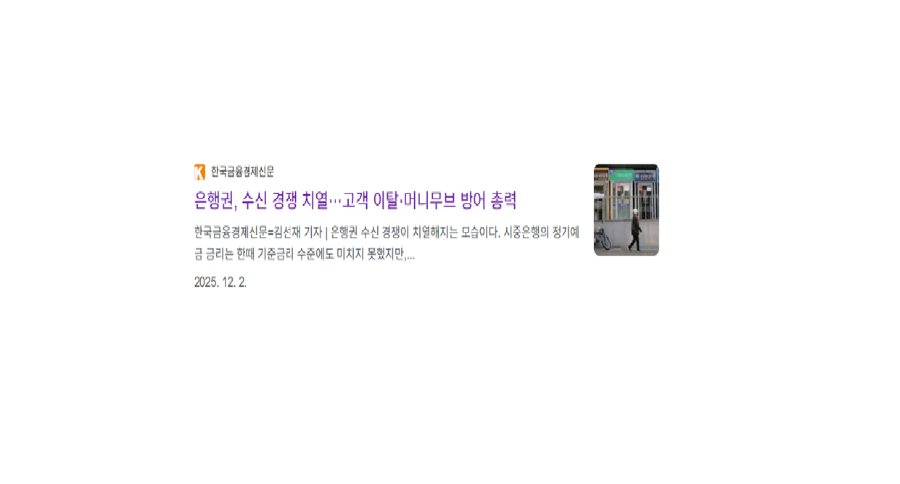
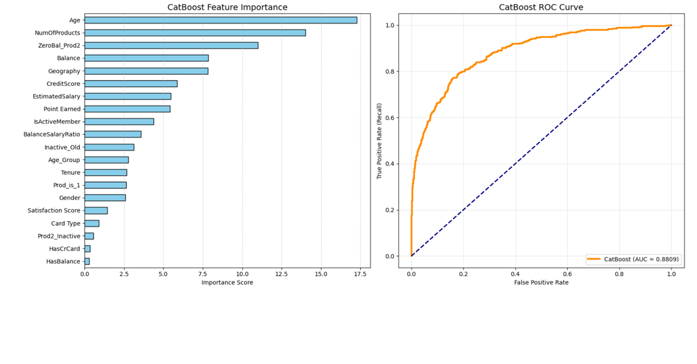

# SKN25-2nd-4Team

# 1. 팀 소개
<table>
  <tr>
    <th align="center">박성진</th>
    <th align="center">신문수</th>
    <th align="center">이수영</th>
    <th align="center">이하윤</th>
    <th align="center">최준명</th>
  </tr>
  <tr>
    <td align="center"><a href="https://github.com/acegikmoop-code">acegikmoop</a></td>
    <td align="center"><a href="https://github.com/MunSu2001">MunSu2001</a></td>
    <td align="center"><a href="https://github.com/swimworld-kr">swimworld-kr</a></td>
    <td align="center"><a href="https://github.com/lhyckh6628">lhyckh6628</a></td>
    <td align="center"><a href="https://github.com/jtschoy">jtschoy</a></td>
  </tr>
  <tr>
    <td colspan="5" align="center">
      데이터셋 선택, 데이터 분석, 데이터 전처리, 모델 성능 비교 및 선정, 하이퍼 파라미터 튜닝 
    </td>
  </tr>
</table>

# 2. 프로젝트 기간
</b>
Feb 23, 2026 - Feb 24, 2026
</b>

# 3. 프로젝트 개요
## 프로젝트명
<b>핀-케어(Fin-Care): 행동 편향 기반 이탈 및 자산 유출 예측</b>

## 프로젝트 배경 및 목적

<h3> Background</h3>

 

금융 산업에서 <b>고객 이탈(Churn)</b>은 직접적인 수익 감소로 이어지는 핵심 리스크 요소입니다.
특히 기존 고객을 유지하는 비용은 신규 고객을 유치하는 비용보다 훨씬 낮기 때문에,
이탈을 사전에 감지하고 대응하는 것은 중요한 전략 과제가 됩니다.

그러나 대부분의 이탈 예측 모델은 단순히 
<b>"이 고객이 떠날 확률이 얼마인가?"</b>에 집중할 뿐,
<b>"왜 평소와 다른 행동을 보이는가?"</b>에 대한 설명은 부족한 경우가 많습니다.

금융 데이터는 지역, 카드 타입, 자산 수준, 거래 활동 등
복합적이고 비선형적인 패턴을 가지며,
단순 통계 지표만으로는 행동의 변곡점을 포착하기 어렵습니다.

<h3> Objective</h3>

본 프로젝트의 목적은 단순 예측 모델을 넘어,
<b>의사결정 지원이 가능한 이탈 예측 시스템</b>을 구축하는 것입니다.

<ul>
  <li>✔ 고객 행동 데이터를 기반으로 이탈 확률 사전 예측</li>
  <li>✔ 행동 패턴의 변화(변곡점)를 포착하는 파생변수 설계</li>
  <li>✔ 개별 고객 단위의 이탈 요인 해석(Local Interpretation) 제공</li>
  <li>✔ 고위험 고객 우선순위 자동화 및 실무 대응 전략 지원</li>
</ul>

이를 통해 단순히 <b>예측 정확도를 높이는 것</b>이 아니라,
<b>고객 유지 전략 수립에 직접 활용 가능한 시스템</b>을 구현하는 것을 목표로 합니다.

## 프로젝트 소개
본 프로젝트 **'핀-케어(Fin-Care)'**는 은행 고객의 단순 잔고 변화를 넘어, 행동 편향(Behavioral Bias) 기반의 자산 유출 및 이탈 조기 탐지 시스템 구축을 목표로 합니다.

단순히 "이탈할 것인가?"라는 결과값만 제시하는 기존의 블랙박스 모델에서 탈피하여, **"왜 평소와 다른 패턴으로 금융 행동을 하는가?"**에 대한 데이터 기반의 해답을 제시합니다. 비즈니스 맥락을 정교하게 반영한 패턴 변곡점(Pivot) 파생변수 설계와 해석 가능한 AI(Explainable AI) 기술을 결합하여, 실무자가 즉각적인 마케팅 액션(Action Plan)을 수립할 수 있도록 돕는 최적의 의사결정 지원 도구를 제공합니다.

<h2>기술 및 특 장점 </h2>

<!-- 1. CatBoost -->

  
<b>1️⃣ Why CatBoost?</b> (Categorical-friendly model)

   
  <blockquote>
    범주형 데이터가 많은 금융 고객 데이터에 최적화된 선택
  </blockquote>

  <ul>
    <li><b>지역/성별/카드 타입</b> 등 categorical feature 자동 처리</li>
    <li>별도 인코딩(One-Hot) 없이도 <b>높은 성능 유지</b></li>
    <li>Ordered Boosting 기반으로 <b>과적합 방지에 강점</b></li>
  </ul>

  

    ✅ <b>결론:</b> 금융 고객 데이터 구조에 가장 적합한 알고리즘으로 CatBoost 채택
  

 

<!-- 2. Feature Engineering -->

  
<b>2️⃣ Business-Driven Feature Engineering</b> (Change Point Capture)

   
  <blockquote>
    단순 통계가 아닌, 고객 행동의 <b>‘변곡점(Change Point)’</b>을 포착하는 파생변수 설계
  </blockquote>

  <h4> Core Derived Features</h4>

  <ul>
    <li>
      <b> Age–Wealth Gap</b> 
      동일 연령대 대비 자산 수준의 괴리도 
      → 기대 자산 대비 과도하게 낮은 경우 이탈 위험 증가
    </li>
     
    <li>
      <b> Asset Drain Velocity</b> 
      자산 감소 속도 지표 
      → 급격한 자산 이탈은 불만/서비스 이동 신호 가능
    </li>
  </ul>

  <h4> Behavioral Dynamics Features</h4>
  <ul>
    <li>거래 패턴 변화율</li>
    <li>신용 사용 강도 변화</li>
    <li>활동성 감소 지표</li>
    <li>최근 활동 대비 과거 활동 편차</li>
  </ul>

  

    ✅ <b>핵심:</b> “왜 평소와 다른 금융 행동을 보이는가?”에 답하기 위한 변수 설계
  

 

<!-- 3. Threshold -->

  
<b>3️⃣ Threshold Optimization Strategy</b> (Recall-first)

   
  <blockquote>
    정확도보다 중요한 건 <b>고위험 고객을 놓치지 않는 것</b>
  </blockquote>

  <ul>
    <li>기본 Threshold 0.5 대신 <b>0.4로 조정</b></li>
    <li>금융 이탈 예측에서는 <b>False Negative</b>(놓침)가 더 치명적</li>
    <li><b>Recall 중심</b>으로 실무 적용 전략 설계</li>
  </ul>

  <h4>📈 Model Performance</h4>

  <table>
    <thead>
      <tr>
        <th align="left">Metric</th>
        <th align="left">Score</th>
      </tr>
    </thead>
    <tbody>
      <tr>
        <td><b>AUC</b></td>
        <td><b>0.88</b></td>
      </tr>
      <tr>
        <td><b>Recall</b></td>
        <td><b>81%</b></td>
      </tr>
      <tr>
        <td>Precision</td>
        <td>48%</td>
      </tr>
      <tr>
        <td>Accuracy</td>
        <td>78%</td>
      </tr>
      <tr>
        <td>f1-score</td>
        <td>60%</td>
      </tr>
    </tbody>
  </table>

  

    🎯 <b>전략적 선택:</b> 재현율 중심 설계로 고위험 고객 선제 대응 가능
  

 

<h3>💡 Key Takeaway</h3>

<ul>
  <li>✔ 단순 예측 모델이 아닌 <b>의사결정 지원 모델</b></li>
  <li>✔ 비즈니스 맥락 기반 파생변수로 <b>행동 변곡점</b> 포착</li>
  <li>✔ <b>Threshold 최적화(0.4)</b>로 위험 고객을 놓치지 않는 전략</li>
</ul>

<h2>👥 대상 사용자</h2>

본 시스템은 단순 데이터 분석용 모델이 아니라,
<b>실무 의사결정에 직접 활용 가능한 도구</b>를 목표로 설계되었습니다.

<h3>1. CRM / 마케팅 전략 담당자</h3>
<ul>
  <li>이탈 위험 고객을 사전에 식별하여 맞춤형 프로모션 설계</li>
  <li>고위험 고객 우선 관리 전략 수립</li>
  <li>마케팅 비용 대비 효율(ROI) 극대화</li>
</ul>

<h3>2. 데이터 분석가 / 데이터 사이언티스트</h3>
<ul>
  <li>이탈 요인 해석을 통한 인사이트 도출</li>
  <li>행동 변곡점 기반 세그먼트 분석</li>
  <li>추가 모델 고도화 및 실험 설계</li>
</ul>

<h3>3️. 리스크 관리 / 전략 기획 부서</h3>
<ul>
  <li>고객 자산 이탈 패턴 모니터링</li>
  <li>이탈률 감소를 위한 정책 수립</li>
  <li>중장기 고객 유지 전략 설계</li>
</ul>

<h3>4️. 경영진 / 의사결정자</h3>
<ul>
  <li>이탈 위험 지표 기반 KPI 관리</li>
  <li>데이터 기반 전략적 의사결정 지원</li>
  <li>고객 유지율 개선을 통한 수익 안정화</li>
</ul>

<h3>기대효과</h3>

<ul>
  <li>고위험 고객 선제적 관리 가능</li>
  <li>마케팅 비용 효율화</li>
  <li>이탈 원인 기반 맞춤 대응 전략 수립</li>
  <li>데이터 기반 CRM 의사결정 고도화</li>
</ul>

# 5. 수행결과
### 📊 모델 성능 비교

| Model | AUC | Precision | Recall | F1-score |
| :--- | :---: | :---: | :---: | :---: |
| Logistic Regression | 0.84 | 0.37 | 0.85 | 0.52 |
| Random Forest | 0.85 | 0.45 | 0.78 | 0.57 |
| XGBoost | 0.86 | 0.45 | 0.80 | 0.57 |
| LightGBM | 0.86 | 0.44 | 0.81 | 0.57 |
| CatBoost | 0.88 | 0.48 | 0.81 | 0.60 |
| ANN | 0.86 | 0.43 | 0.81 | 0.56 |
 

### 📈 CatBoost

 

### Streamlit

### 이탈확률별 분류
| 분류 | 이탈확률 | 판정 | 
| :---: | :---: | :---: | 
| High risk | >70% | 이탈 |
| Medium risk | >40% | 이탈 |
| Low list | <40% | 유지 |
# 6. 한 줄 회고
| 이름 | 회고 |
| :---: | :---: |
| 박성진 | 이번 프로젝트를 통해 협업의 중요성을 다시금 깨닫는 시간이었습니다. 프로젝트 시작 전에는 딥러닝, 머신러닝이 그닥 와닿는 내용은 아니었는데 이번 프로젝트를 통해 EDA부터 모델링의 과정을 수행하며 단순한 예측 모델링을 넘어 비즈니스 가치를 창출하는 데이터 사이언스 워크플로우를 수행할 수 있었던 값진 시간이었습니다.  |
| 신문수 | 이번 프로젝트를 통해 단순히 모델을 학습시키는 것이 아니라, EDA를 통해 데이터의 패턴을 이해하고 그 인사이트를 바탕으로 전처리와 파생변수를 설계하는 과정이 모델 성능에 결정적인 영향을 미친다는 점을 깊이 체감할 수 있었습니다. 또한 여러 머신러닝 모델과 딥러닝 모델을 직접 비교하면서 각 알고리즘의 특성과 장단점을 이해하게 되었고, 특히 불균형 데이터 대응, 교차검증, 임계값 조정과 같은 평가 전략이 실무적인 예측 성능에 얼마나 중요한지 경험할 수 있었습니다. 이번 프로젝트를 통해 데이터 분석에서의 모델 비교, 최적 모델 선정 및 간단한 배포까지의 전 과정을 수행하며 데이터 기반 의사결정의 흐름을 실질적으로 이해하게 되었습니다. |
| 이수영 | EDA부터 모델링, 배포까지 전 과정을 경험하며 데이터가 어떻게 인사이트로, 인사이트가 어떻게 서비스로 이어지는지 흐름을 체감할 수 있었습니다. 짧은 기간이었지만 그만큼 빠르게 많은 것을 배운 프로젝트였습니다. Streamlit으로 결과를 직접 시각화하며 분석과 개발 사이의 간극도 좁힐 수 있었습니다. |
| 이하윤 | 팀원들과 모델 선택에 대해 함께 고민하며 팀 활동에 적응할 수 있었습니다. 단순히 하이퍼파라미터를 튜닝하는 기계적인 작업이 아니라, 비즈니스 비용 구조를 고려한 임계값 조정과 파생변수 설계를 통해 모델의 예측력을 끌어올리는 과정이 가장 보람차고 즐거웠습니다 |
| 최준명 | 이번 프로젝트는 데이터 분석과 머신러닝을 실제 금융 분야의 문제에 적용해볼 수 있었던 의미 있는 경험이었으며, 이탈 예측과 행동 기반 인사이트가 지속 가능한 성장, 효율적인 자원 배분, 그리고 장기적인 성과 향상에 어떻게 기여할 수 있는지 보여주었습니다. |
# 7. 기술스텍
## 🛠 Tech Stack

### Language & Environment

---

###  Data Analysis & Preprocessing

---

###  Machine Learning Models

---

### Visualization

---

###  Deployment (Simulator)

